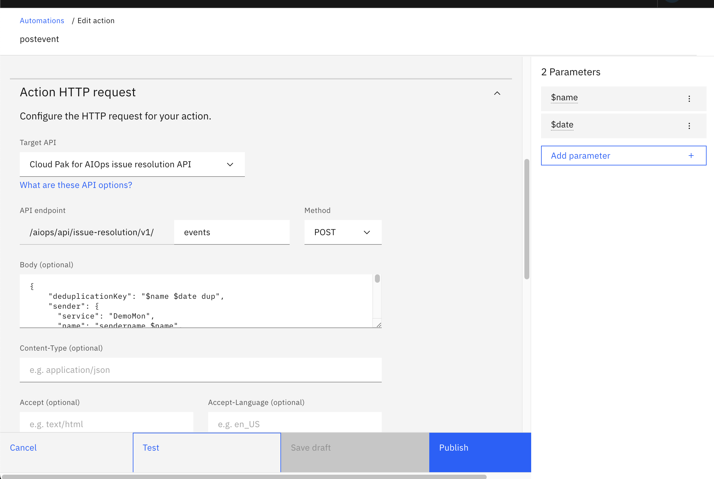
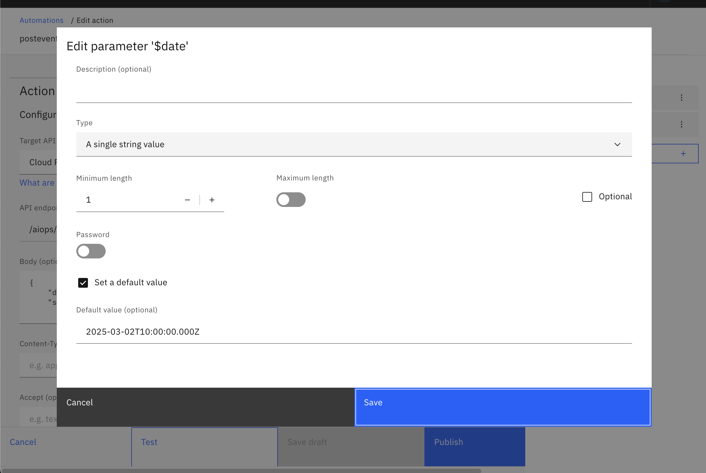
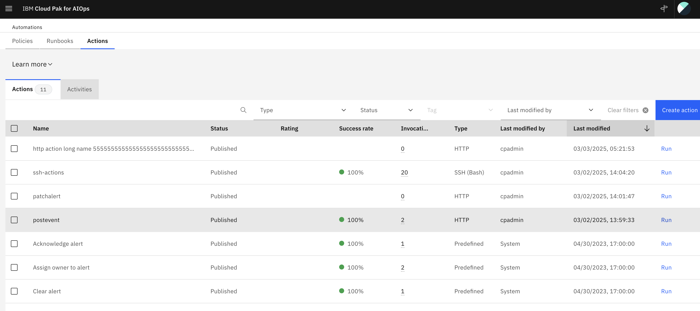

## Alert generation using Automation actions

Go to **Automations** page and click on **Actions** tab.

Then, Click the **Create action** button

Give the new action a name e.g. "postevent"



Add two parameters from the right-side panel.

- "name": Type String, with no default value.
- "date" Type String, default value to current data in this format "2025-03-11T10:00:00.000Z".    



Under **Action HTTP Request**: Select the target api from the dropdown to "Cloud Pak for AIOps issue resolution API".


Enter "events" in the middle text box and "POST" in Method, under API endpoint.

Paste this as Body:
```
{
    "deduplicationKey": "$name $date dup",
    "sender": {
      "service": "DemoMon",
      "name": "sendername $name",
      "type": "Netcool/OMNIbus"
    },
    "details": {
    "12345": "67890",
    "name": "test",
    "key1": "http://www.google.com",
    "sumAggregator": "ALL"
    },
    "resource": {
      "name": "$name $date resourcename",
      "type": "Service",
      "service": "https://example.com"
    },
    "type": {
      "classification": "SMAX test event",
      "eventType": "problem"
    },
    "severity": 5,
    "summary": "$name $date",
    "occurrenceTime": "$date",
    "expirySeconds": 0
  }
  ```

Hit **Publish**

Go back to actions list and hit run



Give it some name in the right-side parameters tab and hit run. 


This should create an alert and, if a [policy is present](./createPolicy.md), an incident.


