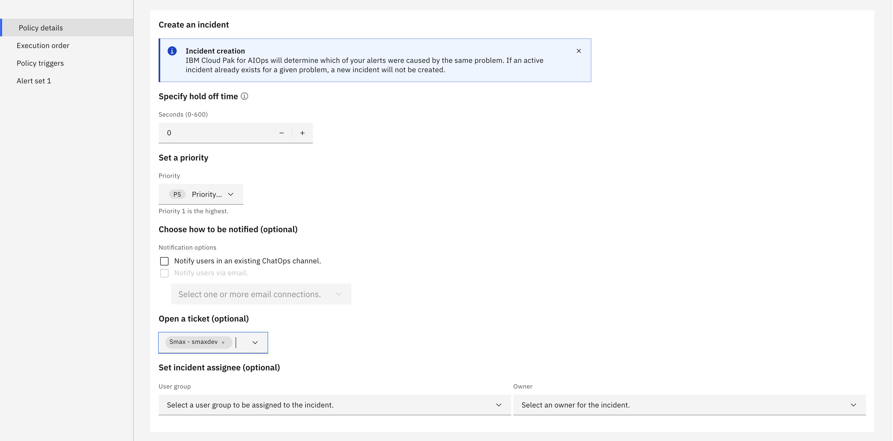

## Create an Incident creation policy

To create a policy that will create an incident based on the classification, go to the **Automations** page, click **Create policy**

Choose **Promote alerts to an incident**

Fill in a name

Set increasing event count as the reason to generate an incident.

Set the alert condition to create an Incident. Click **Add alert condition** and choose "Basic".

Then, click **Add basic condition** and choose "Alert property" condition to check for the alert `classification` field. Use "SMAX test event" as value.

In **Create an incident** section, click the **Open a ticket** selector and pick your SMAX integration.

Scroll back up and hit **Create policy** button at the top-right corner.

To trigger an incident, [generate a test alert](./createAlert.md).

